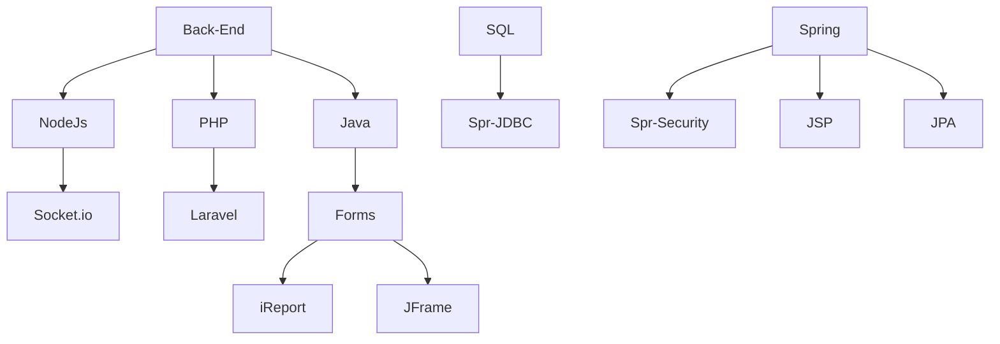

 

<!------------------------------------------GRAFICO DE ACTIVIDAD------------------------------------------------------->

<!----------------------------------------------TARJETAS DE DATOS--------------------------------------------------->

  
   
  
  

 

<!-------------------------------------------------TARJETA DE CONTRIBUCIONES------------------------------------------------>

 

<!------------------------------------------REDES SOCIALES------------------------------------------------------->

      
    
    

<!---------------------------------------------HABILIDADES en FRONTED---------------------------------------------------->

<!---------------------------------------------LENGUAJES---------------------------------------------------->

 
  

 
   
   
    
   
  
  
     
  
  
     
   
   
    
   
   

   
   

<!------------------------------------------views------------------------------------------------------->

 
<b>Visitors Count :) </b>
  

 
 

<!--------------------------------------------views con banderas----------------------------------------------------->

<!------------------------------------------------------------------------------------------------->

<!------------------------------------------------------------------------------------------------->

<!------------------------------------------------------------------------------------------------->

